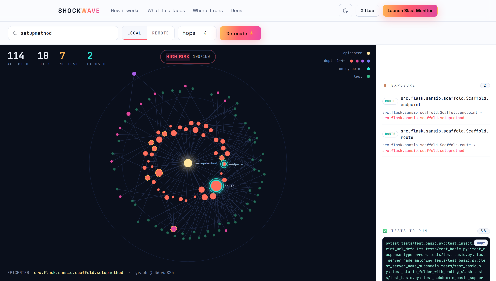
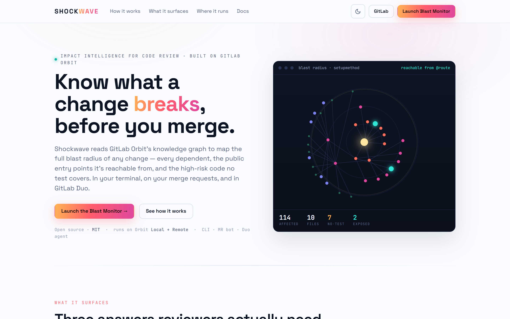

<div align="center">

# ⚡ Shockwave

### Know what a change breaks — *before* you merge.

Impact intelligence for code review, built on the **[GitLab Orbit](https://about.gitlab.com/gitlab-orbit/)** knowledge graph.

[](https://shockwave-ochw.vercel.app/)
[](LICENSE)
[](pyproject.toml)
[](tests/)
[](https://about.gitlab.com/gitlab-orbit/)
[](https://gitlab-transcend.devpost.com/)

**🌐 [Live site & Blast Monitor](https://shockwave-ochw.vercel.app/) · [AI Catalog agent](https://gitlab.com/explore/ai-catalog/agents/1011457/) · [Live MR-bot comment](https://gitlab.com/uthmannabeel-group/Shockwave-project/-/merge_requests/1)**



</div>

---

## The problem

Every reviewer has approved a one-line change that quietly broke something three files away. The honest question in review — *“if I change this, what actually breaks?”* — is one `grep` can't answer, because the answer lives in the **resolved call graph**, not in text. GitLab Orbit already builds that graph. **Shockwave turns it into the answer** — and then acts on it.

## What it surfaces

Point Shockwave at a function, file, or merge-request diff and it traverses Orbit's graph to tell you:

| | | |
|---|---|---|
| ⚡ **Blast radius** | Every definition that transitively depends on the change, across files, ranked by fan-in × proximity. | *impact* |
| 🚪 **Exposure** | Whether the change is **reachable from a public entry point** (route / API / CLI), *with the call path* — externally observable or internal-only. | *reachability* |
| 🧪 **Untested hotspots** | High fan-in code **no test calls directly** — each with a generated **pytest stub** so you know what to pin down. | *coverage* |
| 🚦 **Risk verdict** | One **LOW / REVIEW / HIGH** score from all the signals — the MR bot leads with it and can gate the merge. | *decision* |
| ✅ **Test impact selection** | The tests that *actually exercise* the change, as a copy-paste `pytest …` command. Run those, not the whole suite. | *CI speed* |
| 🔗 **Outbound dependencies** | The flip side of impact: what the change *relies on*. | *completeness* |

> It never guesses — it reports only what the graph returns, flags its own caveats (partial results, ambiguous names, permission scope), and shows the indexed commit.

## 🧭 One graph, five surfaces

The same analysis meets your team wherever review happens:

- **CLI** — `shockwave analyze <symbol|file>` and `shockwave diff <ref>`, against Orbit **Local** or, with `--remote`, the hosted graph. Markdown / JSON / HTML / Mermaid.
- **Blast Monitor** — the interactive web map (below).
- **Merge-request bot** — a GitLab CI job that auto-posts (and updates) the review on every MR. → [see a live comment](https://gitlab.com/uthmannabeel-group/Shockwave-project/-/merge_requests/1)
- **GitLab Duo agent** — ask *“what's the blast radius of X?”* in the AI Catalog. → [view the agent](https://gitlab.com/explore/ai-catalog/agents/1011457/)
- **Orbit Reachability skill** — reusable DSL recipes so any agent can query Orbit correctly. → [`skills/orbit-reachability`](skills/orbit-reachability/SKILL.md)

## 🗺️ The Blast Monitor

A radial **blast map**: the changed symbol is the epicenter, impact ripples outward in depth-colored rings, public **entry points glow cyan** with their call path traced to the core, and the rail shows the risk verdict, the tests to run, and the untested hotspots. Light and dark themes.



```bash
pip install -e ".[web]"
shockwave-web            # → http://127.0.0.1:7777
```

## 🚀 Quick start

```bash
# 1. Install Orbit Local
#    macOS / Linux
curl -fsSL "https://gitlab.com/gitlab-org/orbit/knowledge-graph/-/raw/main/install.sh" | bash
#    Windows (PowerShell)
irm https://gitlab.com/gitlab-org/orbit/knowledge-graph/-/raw/main/install.ps1 | iex

# 2. Index a repo
orbit index /path/to/repo

# 3. Install + analyze
pip install -e .
shockwave analyze <a-function-in-your-repo> --format md
shockwave diff main                       # blast radius of a whole diff
```

**Against Orbit Remote** (the hosted graph — no local index needed):

```bash
shockwave analyze compute --remote https://gitlab.com --token "$GITLAB_TOKEN"
```

Because Remote forbids full-graph scans, the radius is computed by *iterative anchored traversal* — one query per hop. The MR bot and Duo agent use this path.

## See it in action

Asking **Flask** (`pallets/flask`, ~1,650 definitions) what depends on `setupmethod` — a one-line internal decorator:

```text
🚦 Risk: HIGH (100/100) · 7 untested hotspots · reachable from 2 public entry points
⚡ 114 definitions across 10 files depend on this change.
🚪 Reachable from Scaffold.route  (Scaffold.route → setupmethod)
✅ 58 tests exercise it:  pytest tests/test_blueprints.py::test_add_template_filter  …
```

Full reports (Markdown / HTML / JSON) are in [`examples/flask/`](examples/flask).

## 🏗️ How it works

```
seed symbol/file ─▶ resolve to Definition node(s) ─▶ cycle-safe inbound BFS
                    over CALLS + EXTENDS edges ─▶ rank · expose · verdict ·
                    select tests ─▶ report / graph
```

Orbit **Local** is a DuckDB graph queried via `orbit sql`; **Remote** is the hosted graph queried over the JSON traversal DSL. Same walk, same answers. Details in [`docs/ARCHITECTURE.md`](docs/ARCHITECTURE.md).

## ⚠️ What it is — and isn't

A tool you can trust states its edges:

- **Static analysis.** Follows resolved `CALLS`/`EXTENDS` edges — dynamic dispatch, reflection, callbacks, and config-wired calls are invisible; value/constant and non-code changes fall outside the code graph.
- **Signals, not guarantees.** “No *direct* test”, exposure, and the risk score are heuristics (word-boundary matched, not naïve substrings).
- **Bounded by Orbit.** Results reflect Orbit's index — default branch, supported languages, and on Remote only code your token can see (so a radius can be partial). No cross-repo graph yet; depth is capped; large fan-outs may truncate — Shockwave **tells you** when a result is partial.
- **Security reachability** (ranking vulnerabilities by reachability) is the roadmap headline — it needs a join with GitLab's Vulnerability API.

## 🧪 Tests

```bash
pip install -e ".[dev]"
pytest            # 23 tests — algorithm, remote BFS, risk, exposure, test selection
```

## 📄 License

Released under the **MIT License** — © 2026 Nabeel Uthman. See [`LICENSE`](LICENSE) for the full text. Free to use, modify, and distribute.

---

<div align="center">
Built for the <b>GitLab Transcend Hackathon</b> · powered by <a href="https://about.gitlab.com/gitlab-orbit/">GitLab Orbit</a>
</div>
